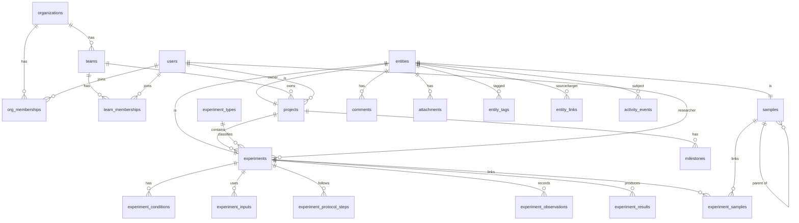

# CytoLab — Architecture

CytoLab is a life-science R&D platform. V1 is an **Experiment & Research Progress
Dashboard**; the architecture is designed so the same codebase can grow into experiment
management, sample/data management, an ELN, and eventually a full R&D operating system
without a rewrite.

This document is the source of truth for structural decisions. Update it when a
decision changes.

---

## 1. Guiding decisions

| Decision | Choice | Why |
| --- | --- | --- |
| Language | TypeScript 5.9, `strict` | One language across UI, API, domain rules, migrations, seed. TS 7 (native) is skipped until `typescript-eslint` supports it. |
| App framework | Next.js 16 (App Router), React 19 | Server Components give fast, data-dense pages without client waterfalls; route handlers host the REST API in the same deployable. |
| Database | PostgreSQL 16 | Relational integrity, partial/trigram/GIN indexes, full-text search, JSONB where genuinely schemaless, RLS for future defense-in-depth. |
| Data access | Drizzle ORM + drizzle-kit SQL migrations | Schema-as-TypeScript with inferred types, SQL-level control (check constraints, partial indexes, generated columns), plain SQL migration files. |
| Validation | Zod 4 | One schema per input, shared by API handlers and client forms. |
| API | REST, versioned under `/api/v1` | Simple, cacheable, easy for integrations, instruments and AI agents to consume. |
| UI | Tailwind CSS 4 + Radix primitives + a local design system | Accessible primitives, tokens as CSS variables (light/dark), no heavy component framework to fight. |
| Charts | Recharts 3 | Composable React charts; wrapped behind our own chart components. |
| Auth | First-party session auth (scrypt + hashed session tokens) | Transparent and dependency-light for V1; the `AuthContext` seam lets SSO/OIDC and API tokens plug in later. |
| Tests | Vitest (unit + DB integration), Playwright (smoke/E2E) | Fast unit tests for domain rules, real-Postgres integration tests for tenancy/RBAC/audit. |

### Architectural style: a modular monolith

One deployable, with hard internal boundaries:

```
┌──────────────────────────────────────────────────────────────┐
│  UI (src/app, src/components)                                │
│   Server Components ──read──▶ services (same functions the   │
│   Client Components ─write─▶ REST API    API uses)           │
├──────────────────────────────────────────────────────────────┤
│  HTTP layer (src/app/api/v1, src/server/http)                │
│   auth → validate (zod) → call service → envelope/errors     │
├──────────────────────────────────────────────────────────────┤
│  Service layer (src/server/modules/*)                        │
│   authorize → load → apply domain rules → persist →          │
│   record events (activity + audit) → index search → notify   │
├──────────────────────────────────────────────────────────────┤
│  Platform (src/server/platform)                              │
│   entity registry · events · search index · storage · ids    │
├──────────────────────────────────────────────────────────────┤
│  Domain (src/domain) — pure, isomorphic, no I/O              │
│   enums · labels · zod schemas · status machines ·           │
│   progress / health / attention rules                        │
├──────────────────────────────────────────────────────────────┤
│  PostgreSQL (Drizzle schema + SQL migrations)                │
└──────────────────────────────────────────────────────────────┘
```

Rules (enforced by ESLint `no-restricted-imports` where practical):

- `src/domain` imports nothing from `server`, `app`, or `components`. It is safe on the client and trivially unit-testable.
- `src/server/**` is marked `server-only`; UI components never import it.
- **Reads**: Server Components call service functions directly with the request's `AuthContext` — the same functions the REST `GET` handlers call, so authorization is identical.
- **Writes**: always go through the REST API (`src/lib/api-client.ts`). The UI has no private mutation path; everything the UI can do, an integration or AI agent can do through the same audited endpoint.
- Every service function takes `ctx: AuthContext` as its first argument. There is no way to query tenant data without one.

When a second deployable is needed (background worker, instrument gateway, AI service),
`src/domain` and `src/server` move into workspace packages (`packages/domain`,
`packages/core`) mechanically — the dependency direction already allows it.

---

## 2. Directory layout

```
docs/                     architecture, API notes
drizzle/                  generated SQL migrations (committed, reviewed)
scripts/                  migrate, seed, reset, jobs
src/
  app/
    (auth)/login          sign-in
    (workspace)/          authenticated shell: dashboard, projects, experiments,
                          timeline, progress, activity, search, notifications,
                          teams, settings, coming-soon modules
    api/v1/               REST route handlers (thin)
  components/
    ui/                   design-system primitives (no domain knowledge)
    shell/                sidebar, top bar, command palette, notifications
    charts/               chart wrappers bound to design tokens
    <feature>/            projects, experiments, activity, dashboard, …
  domain/                 isomorphic enums, schemas, pure business rules
  server/
    db/                   Drizzle client + schema (one file per module)
    auth/                 passwords, sessions, AuthContext resolution
    authz/                role → permission matrix, policy helpers
    http/                 API handler wrapper, error mapping
    platform/             entities, events, search, storage, sequences
    modules/<module>/     services per bounded context
  lib/                    client-safe utilities (api client, formatting)
tests/                    integration + e2e
```

---

## 3. Data model

### 3.1 Conventions

- **UUIDv7 primary keys**, generated in the app (time-ordered → good index locality; globally unique → any table can later be promoted into the entity registry without changing IDs).
- **Tenancy**: every tenant-scoped row carries `org_id`. Services always filter on `ctx.orgId`; composite indexes lead with `org_id`.
- **Audit columns**: `created_at`, `updated_at`, `created_by`, `updated_by` on mutable business tables.
- **Soft deletion** (`deleted_at`) on user-authored objects (projects, experiments, samples, milestones, comments, attachments). Uniqueness constraints are partial (`WHERE deleted_at IS NULL`). *Archived* is a business status and stays visible; *deleted* is hidden and admin-restorable.
- **Optimistic concurrency**: `version` on projects and experiments; `PATCH` may send `expectedVersion` and receives `409 Conflict` if someone else saved first.
- **Enums** for workflow states (Postgres enums; adding values is cheap). Org-configurable workflows would move to tables later.
- **Human IDs**: `EXP-1024`, `SMP-00042`, milestone `M3`, user-defined project codes like `CART-001`. Per-org counters live in `id_sequences` and are incremented atomically inside the creating transaction.
- **JSONB only where the shape is genuinely open**: activity payloads, audit diffs. Anything we filter, sort, or aggregate on is a typed column.

### 3.2 The entity registry (knowledge-graph backbone)

First-class scientific objects (Project, Experiment, Sample today; Protocol, Dataset,
Result, Notebook Entry, … later) each get a row in `entities`, sharing the object's UUID:

```
entities(id PK, org_id, entity_type, display_id, title, created_at, deleted_at)
projects.id     ──FK──▶ entities.id
experiments.id  ──FK──▶ entities.id
samples.id      ──FK──▶ entities.id
```

Generic capabilities reference `entities.id` **with real foreign keys**, so they work
for every current and future object type with zero schema changes:

- `comments`, `attachments`, `entity_tags`, `activity_events`, `notifications`
- `entity_links` — typed edges between any two objects (`related_to`, `follow_up_of`,
  `replicate_of`, `derived_from`, `references`). Together with typed FKs
  (experiment → project, sample → parent sample), this is the knowledge graph.
- Universal resolution: `GET /api/v1/entities/:id` and `?displayId=EXP-1024`, which the
  future ELN uses for `@mentions` and the AI layer uses for citations.

`display_id` and `title` are denormalized into the registry (synced by the owning
service in the same transaction) so feeds, notifications, and links render any object
type with one join.

### 3.3 Tables (V1)

**Identity & tenancy**

| Table | Purpose / key columns |
| --- | --- |
| `organizations` | Tenant. `name`, `slug`, `is_demo`. |
| `users` | Global identity: `email` (unique, case-insensitive), `name`, `title`, `avatar_url`, `avatar_color`, `password_hash` (nullable for future SSO), `status`. |
| `org_memberships` | User ↔ org with `role` (`admin`, `lab_manager`, `scientist`, `researcher`, `viewer`). Users can belong to several orgs (CRO/partner collaboration). |
| `teams` / `team_memberships` | Teams within an org; membership `role` (`lead`, `member`). |
| `sessions` | `token_hash` (SHA-256 of a random token — raw token only in the cookie), `org_id` (active org), `expires_at`, `revoked_at`, ip/user agent. |

**Research structure**

| Table | Purpose / key columns |
| --- | --- |
| `research_areas` | Org lookup (Cell Therapy, Nucleic Acid Delivery, …). |
| `projects` | `code`, `name`, `description`, `research_area_id`, `owner_id`, `team_id`, `status` (`planning`, `active`, `on_hold`, `completed`, `archived`), `priority`, `start_date`, `target_date`, `completed_at`, `notes`, `version`. |
| `milestones` | Per project: `sequence` (→ `M3`), `title`, `due_date`, `status` (`pending`, `in_progress`, `completed`, `cancelled`), `completed_at`, `owner_id`. |
| `experiment_types` | Org-configurable: `name`, `category`, `description`, `color`. Future: structured field templates. |
| `experiments` | `number`/`display_id`, `project_id` (required), `experiment_type_id`, `name`, `objective`, `hypothesis`, `researcher_id`, `team_id`, `status` (`planned`, `in_progress`, `completed`, `failed`, `cancelled`, `archived`), `priority`, `start_date`, `target_date`, `completed_date`, `protocol_ref`, `blocked_reason`, `results_summary`, `conclusion`, `notes`, `status_changed_at`, `last_activity_at`, `version`. |
| `experiment_conditions` | Structured parameters: `name`, `value`, `numeric_value`, `unit`. |
| `experiment_inputs` | Materials used: `name`, `input_type` (reagent, cell line, plasmid, …), `identifier` (catalog/lot), `quantity`, `unit`. Future FK → inventory. |
| `experiment_protocol_steps` | Ordered steps with completion tracking. Future: instantiated from a protocol version. |
| `experiment_observations` | Timestamped observations with `significance`. Precursor of notebook entries. |
| `experiment_results` | Structured measurements: `name`, `value_numeric`/`value_text`, `unit`, optional `sample_id`, `is_key`. Future: promoted to Result/Measurement entities. |
| `samples` | Minimal registry (entity): `display_id`, `name`, `sample_type`, `status`, `parent_sample_id` (lineage/aliquots), `project_id`, `quantity`/`unit`, `storage_location`. |
| `experiment_samples` | Experiment ↔ sample with `role` (`input`, `output`). |

**Collaboration, events, platform**

| Table | Purpose / key columns |
| --- | --- |
| `tags` / `entity_tags` | Org tag vocabulary; tags attach to any entity. |
| `comments` | On any entity; `parent_id` for threads; soft delete. |
| `attachments` | On any entity: `file_name`, `content_type`, `size_bytes`, `storage_key` (random, never user-controlled), `checksum_sha256`. |
| `entity_links` | Typed graph edges between entities (unique per source/target/type, no self-links). |
| `activity_events` | Human-meaningful feed: `action` (`experiment.status_changed`, …), `actor_id`, `actor_type` (`user`, `system`, `integration`, `ai_agent`), `entity_id`, `project_id`, `payload` (JSONB). |
| `audit_log` | Compliance trail: every mutation with field-level `changes`, request metadata. **Append-only** — a trigger rejects UPDATE/DELETE. |
| `notifications` | Per recipient: `type`, `entity_id`, `actor_id`, `title`, `body`, `read_at`, `dedupe_key` (idempotent job-generated alerts). |
| `search_documents` | Denormalized search index keyed by `(object_type, object_id)`: weighted `tsvector` (generated column) + trigram indexes. |
| `id_sequences` | Per-org counters for human IDs. |

Activity vs. audit are deliberately separate: the feed is curated for people and may be
summarized; the audit log is complete, immutable, and field-level, as regulated
environments (GxP / 21 CFR Part 11) require.

### 3.4 Core relationships



### 3.5 Future entities and where they attach

| Future object | Attaches via |
| --- | --- |
| Program | `programs` table; nullable `projects.program_id`. |
| Protocol / Protocol version | New entity types; `experiments.protocol_version_id`; steps instantiated into `experiment_protocol_steps`. |
| Sample type, Container, Storage location, Inventory, Reagent | `sample_types`, `containers`, `storage_locations` tables; `samples.sample_type_id`, `samples.container_id`; `experiment_inputs.inventory_item_id`. |
| Dataset, Measurement, Result | Entity types; `experiment_results` rows promoted by registering their existing UUIDs; `entity_links` for lineage (`derived_from`). |
| Instrument, Assay, Cell line, Construct, Plasmid, Sequence, Compound | Entity types with typed tables; linked with typed FKs where cardinality is fixed, `entity_links` otherwise. |
| Notebook entry (ELN) | Entity type with block-based document body (e.g. ProseMirror JSON), `entry_versions`, `signatures`; observations migrate into entries. |
| Task | Entity type (assignee, due date, status) linked to any entity. |

---

## 4. Authorization & security

- **Authentication**: email + password (scrypt, per-user salt, constant-time compare). A session is a 256-bit random token; only its SHA-256 hash is stored. Cookie: `HttpOnly`, `SameSite=Lax`, `Secure` in production, 14-day sliding expiry, server-side revocation. Demo mode adds one-click demo accounts.
- **AuthContext**: `{ userId, orgId, role, permissions, actorType, requestId }` resolved once per request. Bearer API tokens, service accounts, and SSO (OIDC/SAML) plug in here.
- **RBAC**: permissions are strings (`experiment:update`, `project:create`, `team:manage`, …). Roles map to permission sets in one matrix (`src/domain/permissions.ts`). Resource-aware policies (e.g. researchers edit experiments they own or are assigned to) live beside it. Granular project-level roles later add a `project_members` table without changing call sites (`authorize(ctx, permission, resource)`).
- **Tenant isolation**: enforced in every service query (`org_id = ctx.orgId`), cross-tenant references rejected on write, covered by integration tests. Postgres RLS is the planned defense-in-depth layer.
- **API hardening**: Zod validation of every body/query; JSON-only mutations; `Origin` check on non-GET requests (CSRF); uniform error envelope that never leaks internals; request IDs; security headers (`X-Frame-Options`, `nosniff`, `Referrer-Policy`, `Permissions-Policy`, COOP); login rate limiting.
- **Content-Security-Policy**: a per-request nonce set in `src/proxy.ts` (production) gives `script-src 'self' 'nonce-…' 'strict-dynamic'` — no `'unsafe-inline'` for scripts, so injected inline script cannot execute. `style-src` keeps `'unsafe-inline'` because React emits inline `style` attributes (governed by `style-src-attr`, which a nonce cannot cover); no CSP is enforced in development, where Fast Refresh needs `eval`.
- **Files**: size limits, random storage keys, authenticated download route that re-checks access, `Content-Disposition: attachment` + `nosniff`. Storage behind a `StorageProvider` interface (local disk in V1; S3 with signed URLs later).
- **Secrets**: environment variables validated at startup (`src/server/env.ts`); `.env` never committed.
- **Audit**: every mutation writes `audit_log` in the same transaction as the change.

---

## 5. API design

- Base path `/api/v1`. JSON in, JSON out.
- Success: `{ "data": … }`; lists add `"meta": { "page", "pageSize", "total" }` (offset) or `"meta": { "nextCursor" }` (feeds).
- Errors: `{ "error": { "code", "message", "details?", "requestId" } }` with 400/401/403/404/409/422/429/500.
- Filtering via query params (`status=planned,in_progress&projectId=…&q=…&sort=-updatedAt&page=2`).

| Area | Endpoints |
| --- | --- |
| Auth | `POST /auth/login`, `POST /auth/logout`, `GET /auth/session`, `GET /auth/demo-accounts` |
| Projects | `GET/POST /projects`, `GET/PATCH/DELETE /projects/:id`, `GET /projects/:id/experiments`, `GET/POST /projects/:id/milestones`, `PATCH/DELETE /milestones/:id` |
| Experiments | `GET/POST /experiments`, `GET/PATCH/DELETE /experiments/:id`, `GET/POST /experiments/:id/{conditions,inputs,steps,observations,results,samples}`, `PATCH/DELETE /experiments/:id/{…}/:itemId` |
| Generic entity | `GET /entities/:id`, `GET /entities/resolve?displayId=`, `GET/POST /entities/:id/comments`, `GET/POST /entities/:id/attachments`, `PUT /entities/:id/tags`, `GET/POST /entities/:id/links`, `GET /entities/:id/activity` |
| Files | `GET /attachments/:id/download`, `DELETE /attachments/:id` |
| Feeds | `GET /activity`, `GET /notifications`, `POST /notifications/read` |
| Search | `GET /search?q=&types=` |
| Insights | `GET /dashboard`, `GET /analytics/progress`, `GET /timeline` |
| Directory | `GET/POST /users`, `GET/PATCH /users/:id`, `GET/POST /teams`, `GET/PATCH /teams/:id`, `POST/DELETE /teams/:id/members` |
| Config | `GET/POST /experiment-types`, `GET/POST /tags`, `GET /research-areas` |
| Samples | `GET/POST /samples`, `GET /samples/:id` |

New modules (samples, protocols, datasets, inventory) follow the same shape: a module
folder in `src/server/modules`, Zod schemas in `src/domain`, route handlers under
`/api/v1/<resource>`, a search indexer registration, and an `entity_type` value.

### Search architecture

`search_documents` is a denormalized index. Each module registers an **indexer**
(`toSearchDocument(row)`) and calls `index/remove` inside its write transaction. The
search service runs one ranked query (`websearch_to_tsquery` + trigram similarity for
IDs and short prefixes) across all types, scoped by `org_id`. V1 indexes projects,
experiments, and users. Adding a type = one indexer. Swapping to OpenSearch/Typesense or
adding pgvector semantic search replaces the provider, not the call sites.

### Event pipeline

`recordEvent(tx, event)` writes the activity event and audit entry, then applies
notification rules (assignment, status change, milestone, comment, attention) — all in
the mutation's transaction. This is deliberately synchronous in V1. At scale it becomes
a transactional **outbox** drained by a worker (email/Slack delivery, webhooks, AI
summarization) without changing callers.

---

## 6. UI / component architecture

- **Shell**: sidebar grouped into *Workspace* (Dashboard, Projects, Experiments,
  Timeline, Progress, Activity), *Lab modules — coming soon* (Samples, Protocols, Data,
  Inventory, visibly marked), and *Organization* (Teams, Settings). Top bar: ⌘K search,
  notifications, user menu.
- **Server-first pages**: each page is a Server Component that fetches through services
  in parallel and streams sections behind `Suspense` with skeletons.
- **URL as state**: filters, sorting, pagination, and tabs live in the URL (shareable,
  back-button friendly).
- **Mutations**: client components call the typed API client, show optimistic/pending
  state, toast the result, and `router.refresh()` to re-render server data.
- **Design system** (`components/ui`): tokens as CSS variables (neutral scale, one
  accent, semantic status colors) with light/dark themes; primitives built on Radix
  (dialog, dropdown, popover, tooltip, tabs, select) — accessible by default.
- **Domain components** (`components/<feature>`) own presentation of domain concepts:
  `StatusBadge`, `PriorityIcon`, `HealthBadge`, `ExperimentTable`, `ActivityItem`, …
- **Keyboard-first**: ⌘K palette (navigate, search, create), `/` to search lists,
  `c` to create in context, `Esc` to close, full focus management.

The experiment detail page is the template for future scientific workspaces: header
(identity, status, attention), a properties rail (Linear-style), and tabs for structured
sub-records. Protocols, samples, and datasets reuse this layout.

---

## 7. AI readiness

No simulated AI ships in V1. Instead, the platform exposes the structured operations an
assistant would need, all permission-checked and audited:

| Question | Existing capability |
| --- | --- |
| "Which experiments failed this month?" | `GET /experiments?status=failed&completedFrom=…` |
| "What experiments are currently blocked / need attention?" | Attention rules in `src/domain/attention.ts`; `GET /experiments?attention=true` |
| "Find experiments using this protocol / sample" | `protocol_ref` filter; `experiment_samples`; `entity_links` |
| "Summarize this project's progress" | `GET /projects/:id` (progress, health with reasons, milestones), `GET /entities/:id/activity` |
| "Generate a summary of the latest research activity" | `GET /activity?since=…` |
| "Compare results from these experiments" | Structured `experiment_results` (numeric values + units) |

An assistant acts through an `AuthContext` with `actorType: 'ai_agent'` on behalf of a
user: it sees only what that user can see, and every write is attributed in the audit
log. Later additions: pgvector embeddings on `search_documents`, retrieval with entity
citations, and tool definitions generated from the API's Zod schemas.

---

## 8. Roadmap

| Phase | Scope |
| --- | --- |
| **1 — Dashboard (this build)** | Overview, projects, experiments workspace, timeline, progress analytics, activity, search, notifications, users/teams, RBAC, audit log, synthetic demo data. |
| 2 — Experiment management | Experiment templates per type, protocol library with versions, tasks, board view, saved views, bulk edit, @mentions, project-level permissions, API tokens, email notifications, CSV export. |
| 3 — Scientific data & samples | Sample registry UI, sample types with schemas, containers & storage, aliquots, lineage graph, inventory/reagents, datasets & measurements, instrument file parsing, S3 storage. |
| 4 — Collaborative R&D | Block-based ELN with version history, review/approval workflows, e-signatures (21 CFR Part 11), real-time co-editing, SSO/SAML/SCIM, Postgres RLS, outbox + workers. |
| 5 — R&D operating system | Permission-aware AI assistant over the knowledge graph, semantic search, integrations (LIMS, instruments, ERP), workflow automation, analytics warehouse. |

---

## 9. Risks and trade-offs

| Risk / decision | Mitigation |
| --- | --- |
| Monolith coupling as scope grows | Strict layering; domain and services are framework-agnostic and can move to packages/services. |
| App-level tenant filtering can be forgotten | `ctx` is mandatory for every service call; integration tests assert isolation; RLS planned. |
| Synchronous side effects (activity, search, notifications) add write latency | Acceptable at V1 scale and keeps them transactionally consistent; outbox pattern planned. |
| Postgres FTS limits (relevance, typo tolerance, scale) | Indexer abstraction; trigram fallback for IDs; swap provider later. |
| Drizzle is pre-1.0 | Version pinned; migrations are plain SQL and portable. |
| First-party auth carries security responsibility | Small, well-tested surface; standard primitives; SSO provider planned for enterprise. |
| Computed progress/health may not match a PI's judgement | Rules are transparent (reasons shown in UI) and unit-tested; manual health updates planned. |
| Fixed workflow enums | Adding values is a migration; configurable workflows are a Phase 2 table. |
| Synthetic demo data mistaken for real findings | Org flagged `is_demo`; persistent in-app banner; seeded names and files marked synthetic. |
