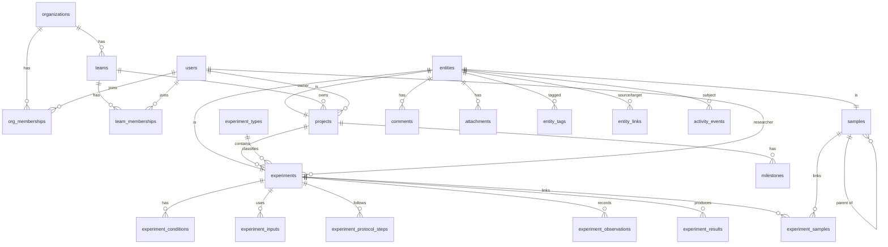

# CytoLab — Architecture

CytoLab is a life-science R&D platform. V1 is an **Experiment & Research Progress
Dashboard**; the architecture is designed so the same codebase can grow into experiment
management, sample/data management, an ELN, and eventually a full R&D operating system
without a rewrite.

This document is the source of truth for structural decisions. Update it when a
decision changes.

---

## 1. Guiding decisions

| Decision | Choice | Why |
| --- | --- | --- |
| Language | TypeScript 5.9, `strict` | One language across UI, API, domain rules, migrations, seed. TS 7 (native) is skipped until `typescript-eslint` supports it. |
| App framework | Next.js 16 (App Router), React 19 | Server Components give fast, data-dense pages without client waterfalls; route handlers host the REST API in the same deployable. |
| Database | PostgreSQL 16 | Relational integrity, partial/trigram/GIN indexes, full-text search, JSONB where genuinely schemaless, RLS for future defense-in-depth. |
| Data access | Drizzle ORM + drizzle-kit SQL migrations | Schema-as-TypeScript with inferred types, SQL-level control (check constraints, partial indexes, generated columns), plain SQL migration files. |
| Validation | Zod 4 | One schema per input, checked by every API handler; shared helpers bound text length, arrays, dates and characters Postgres cannot store. (Client forms do not use the schemas yet.) |
| API | REST, versioned under `/api/v1` | Simple, cacheable, easy for integrations, instruments and AI agents to consume. |
| UI | Tailwind CSS 4 + Radix primitives + a local design system | Accessible primitives, tokens as CSS variables (light/dark), no heavy component framework to fight. |
| Charts | Recharts 3 | Composable React charts; wrapped behind our own chart components. |
| Auth | First-party session auth (scrypt + hashed session tokens) | Transparent and dependency-light for V1; the `AuthContext` seam lets SSO/OIDC and API tokens plug in later. |
| Tests | Vitest (unit + DB integration), Playwright (smoke/E2E) | Fast unit tests for domain rules, real-Postgres integration tests for tenancy/RBAC/audit. |

### Architectural style: a modular monolith

One deployable, with hard internal boundaries:

```
┌──────────────────────────────────────────────────────────────┐
│  UI (src/app, src/components)                                │
│   Server Components ──read──▶ services (same functions the   │
│   Client Components ─write─▶ REST API    API uses)           │
├──────────────────────────────────────────────────────────────┤
│  HTTP layer (src/app/api/v1, src/server/http)                │
│   auth → validate (zod) → call service → envelope/errors     │
├──────────────────────────────────────────────────────────────┤
│  Service layer (src/server/modules/*)                        │
│   authorize → load → apply domain rules → persist →          │
│   record events (activity + audit) → index search → notify   │
├──────────────────────────────────────────────────────────────┤
│  Platform (src/server/platform)                              │
│   entity registry · events · search index · storage · ids    │
├──────────────────────────────────────────────────────────────┤
│  Domain (src/domain) — pure, isomorphic, no I/O              │
│   enums · labels · zod schemas · status machines ·           │
│   progress / health / attention rules                        │
├──────────────────────────────────────────────────────────────┤
│  PostgreSQL (Drizzle schema + SQL migrations)                │
└──────────────────────────────────────────────────────────────┘
```

Rules (enforced by ESLint `no-restricted-imports` where practical):

- `src/domain` imports nothing from `server`, `app`, `components`, `lib`, Next or React. It is safe on the client and trivially unit-testable.
- `src/server/**` is marked `server-only`; UI components and `src/lib` import it only for types.
- **Reads**: Server Components call service functions directly with the request's `AuthContext` — the same functions the REST `GET` handlers call, so authorization is identical.
- **Writes**: always go through the REST API (`src/lib/api-client.ts`). The UI has no private mutation path; everything the UI can do, an integration or AI agent can do through the same audited endpoint.
- Every service function takes `ctx: AuthContext` as its first argument. There is no way to query tenant data without one.

When a second deployable is needed (background worker, instrument gateway, AI service),
`src/domain` and `src/server` move into workspace packages (`packages/domain`,
`packages/core`) mechanically — the dependency direction already allows it.

### Runtime and deployment

One Docker image (`Dockerfile`) serves the app and runs the jobs. The public demo
runs on Railway behind Cloudflare (`DEPLOY.md`):

| Service | Runs | Database role |
| --- | --- | --- |
| `web` | `scripts/docker/start.sh`: migrate, seed if a public demo is empty, `next start` | Migrates as the owner (`MIGRATION_DATABASE_URL`), serves as `APP_DB_ROLE` (`DATABASE_URL`) |
| `reset` | `pnpm db:reset` nightly (public demo only) | Owner; re-grants the app role after rebuilding the schema |
| `attention` | `pnpm jobs:attention` daily | App role |
| `Postgres` | Railway-managed PostgreSQL 16 | — |

The app role can read and write rows but owns nothing: it cannot alter the schema,
update or delete audit rows, or drop the triggers that keep `audit_log` append-only
(`grantAppRole` in `src/server/db/maintenance.ts`). Side effects still run
synchronously inside each request's transaction; there is no queue yet.

---

## 2. Directory layout

```
docs/                     architecture (this file)
drizzle/                  generated SQL migrations (committed, reviewed) + custom SQL (audit trigger)
scripts/                  db-migrate, db-seed, db-reset, db-grant, jobs-attention-scan
  lib/                    destructive-run guard, owner/app database URLs
  seed/                   synthetic demo catalog and generator
  docker/                 container entry point, test-database init
src/
  proxy.ts                per-request CSP nonce, www redirect, session-cookie refresh
  app/
    (auth)/login          sign-in
    (workspace)/          authenticated shell: dashboard, projects, experiments,
                          timeline, progress, activity, search, notifications,
                          teams, settings, coming-soon modules
    api/v1/               REST route handlers (thin)
  components/
    ui/                   design-system primitives (no domain knowledge)
    shell/                sidebar, top bar, command palette, notifications menu
    charts/               chart wrappers bound to design tokens
    domain/               status badges, priority, activity rows, ID tags
    <feature>/            projects, experiments, activity, analytics, forms,
                          notifications, settings
  domain/                 isomorphic enums, schemas, permissions, workflows,
                          attention and health rules, file-type rules
  server/
    env.ts                environment schema, parsed on first use
    db/                   Drizzle client, schema split by area (identity, entities,
                          research, collaboration, events, search), maintenance
    auth/                 passwords, sessions, AuthContext, client address
    authz/                authorize(ctx, permission) helpers
    http/                 API handler wrapper, body limits, rate limits, public-demo guard
    platform/             entities, events, search index, sequences, storage
    modules/<module>/     services per bounded context
  lib/                    client-safe utilities (api client, formatting, routes, cookie settings)
tests/                    integration + e2e
```

---

## 3. Data model

### 3.1 Conventions

- **UUIDv7 primary keys**, generated in the app (time-ordered → good index locality; globally unique → any table can later be promoted into the entity registry without changing IDs).
- **Tenancy**: every tenant-scoped row carries `org_id`. Services always filter on `ctx.orgId`, and references a write stores (owners, researchers, teams, types, tags, samples, link targets) must belong to the acting organization; people must be active members.
- **Audit columns**: `created_at`, `updated_at`, `created_by`, `updated_by` on mutable business tables.
- **Soft deletion** (`deleted_at`) on user-authored objects (projects, experiments, milestones, comments, attachments, observations, results). Deleting a project also soft-deletes its experiments, which must all be closed. Project codes, entity display IDs and team names are unique only among live rows. *Archived* is a business status and stays visible; *deleted* is hidden, with no restore path yet. Conditions, inputs and protocol steps are hard-deleted; their audit entry keeps the removed values.
- **Optimistic concurrency**: `version` on projects and experiments. The `UPDATE` matches on the version the request loaded, so of two simultaneous saves only one succeeds; a stale `expectedVersion` or a lost race returns `409 Conflict`.
- **Enums** for workflow states (Postgres enums; adding values is cheap). Org-configurable workflows would move to tables later.
- **Human IDs**: `EXP-1024`, `SMP-00042`, milestone `M3`, user-defined project codes like `CART-001`. Experiment and sample numbers come from per-org counters in `id_sequences`, milestones from a per-project counter (`milestone:<projectId>`), each incremented inside the creating transaction and first raised to the highest number in use, so records written without the counter (older seeds, imports) are skipped rather than collided with. The seed raises the counters past the numbers it writes.
- **JSONB only where the shape is genuinely open**: activity payloads, audit diffs. Anything we filter, sort, or aggregate on is a typed column.

### 3.2 The entity registry (knowledge-graph backbone)

First-class scientific objects (Project, Experiment, Sample today; Protocol, Dataset,
Result, Notebook Entry, … later) each get a row in `entities`, sharing the object's UUID:

```
entities(id PK, org_id, entity_type, display_id, title, created_at, deleted_at)
projects.id     ──FK──▶ entities.id
experiments.id  ──FK──▶ entities.id
samples.id      ──FK──▶ entities.id
```

Generic capabilities reference `entities.id` **with real foreign keys**, so they work
for every current and future object type with zero schema changes:

- `comments`, `attachments`, `entity_tags`, `activity_events`, `notifications`
- `entity_links` — typed edges between any two objects (`related_to`, `follow_up_of`,
  `replicate_of`, `derived_from`, `references`). Together with typed FKs
  (experiment → project, sample → parent sample), this is the knowledge graph.
- Universal resolution: `GET /api/v1/entities/:id` and `GET /api/v1/entities/resolve?displayId=EXP-1024`,
  which the future ELN uses for `@mentions` and the AI layer uses for citations.

`display_id` and `title` are denormalized into the registry (synced by the owning
service in the same transaction) so feeds, notifications, and links render any object
type with one join.

### 3.3 Tables (V1)

**Identity & tenancy**

| Table | Purpose / key columns |
| --- | --- |
| `organizations` | Tenant. `name`, `slug`, `is_demo`. |
| `users` | Global identity: `email` (unique, case-insensitive), `name`, `title`, `avatar_url`, `avatar_color`, `password_hash` (nullable for future SSO), `status`. |
| `org_memberships` | User ↔ org with `role` (`admin`, `lab_manager`, `scientist`, `researcher`, `viewer`). Users can belong to several orgs (CRO/partner collaboration). |
| `teams` / `team_memberships` | Teams within an org; membership `role` (`lead`, `member`). |
| `sessions` | `token_hash` (SHA-256 of a random token — raw token only in the cookie), `org_id` (active org), `expires_at`, `revoked_at`, ip/user agent. |

**Research structure**

| Table | Purpose / key columns |
| --- | --- |
| `research_areas` | Org lookup (Cell Therapy, Nucleic Acid Delivery, …). |
| `projects` | `code`, `name`, `description`, `research_area_id`, `owner_id`, `team_id`, `status` (`planning`, `active`, `on_hold`, `completed`, `archived`), `priority`, `start_date`, `target_date`, `completed_at`, `notes`, `version`. |
| `milestones` | Per project: `sequence` (→ `M3`), `title`, `due_date`, `status` (`pending`, `in_progress`, `completed`, `cancelled`), `completed_at`, `owner_id`. |
| `experiment_types` | Org-configurable: `name`, `category`, `description`, `color`. Future: structured field templates. |
| `experiments` | `number`/`display_id`, `project_id` (required), `experiment_type_id`, `name`, `objective`, `hypothesis`, `researcher_id`, `team_id`, `status` (`planned`, `in_progress`, `completed`, `failed`, `cancelled`, `archived`), `priority`, `start_date`, `target_date`, `completed_date`, `protocol_ref`, `blocked_reason`, `results_summary`, `conclusion`, `notes`, `status_changed_at`, `last_activity_at`, `version`. |
| `experiment_conditions` | Structured parameters: `name`, `value`, `numeric_value`, `unit`. |
| `experiment_inputs` | Materials used: `name`, `input_type` (reagent, cell line, plasmid, …), `identifier` (catalog/lot), `quantity`, `unit`. Future FK → inventory. |
| `experiment_protocol_steps` | Ordered steps with completion tracking. Future: instantiated from a protocol version. |
| `experiment_observations` | Timestamped observations with `significance`. Precursor of notebook entries. |
| `experiment_results` | Structured measurements: `name`, `value_numeric`/`value_text`, `unit`, optional `sample_id`, `is_key`. Future: promoted to Result/Measurement entities. |
| `samples` | Minimal registry (entity): `display_id`, `name`, `sample_type`, `status`, `parent_sample_id` (lineage/aliquots), `project_id`, `quantity`/`unit`, `storage_location`. |
| `experiment_samples` | Experiment ↔ sample with `role` (`input`, `output`). |

**Collaboration, events, platform**

| Table | Purpose / key columns |
| --- | --- |
| `tags` / `entity_tags` | Org tag vocabulary; tags attach to any entity. |
| `comments` | On any entity; `parent_id` for threads; soft delete. |
| `attachments` | On any entity: `file_name`, `content_type`, `size_bytes`, `storage_key` (random, never user-controlled), `checksum_sha256`. |
| `entity_links` | Typed graph edges between entities (unique per source/target/type, no self-links). |
| `activity_events` | Human-meaningful feed: `action` (`experiment.status_changed`, …), `actor_id`, `actor_type` (`user`, `system`, `integration`, `ai_agent`), `entity_id`, `project_id`, `payload` (JSONB). |
| `audit_log` | Compliance trail: every business mutation with field-level `changes`, request metadata. **Append-only** — triggers reject UPDATE, DELETE and TRUNCATE, and the app's database role holds neither those privileges nor ownership. |
| `notifications` | Per recipient: `type`, `entity_id`, `actor_id`, `title`, `body`, `read_at`, `dedupe_key` (idempotent job-generated alerts). |
| `search_documents` | Denormalized search index keyed by `(org_id, object_type, object_id)`: weighted `tsvector` (generated column) + trigram indexes. |
| `id_sequences` | Per-org counters for human IDs. |

Activity vs. audit are deliberately separate: the feed is curated for people and may be
summarized; the audit log is complete, immutable, and field-level, as regulated
environments (GxP / 21 CFR Part 11) require.

### 3.4 Core relationships



### 3.5 Future entities and where they attach

| Future object | Attaches via |
| --- | --- |
| Program | `programs` table; nullable `projects.program_id`. |
| Protocol / Protocol version | New entity types; `experiments.protocol_version_id`; steps instantiated into `experiment_protocol_steps`. |
| Sample type, Container, Storage location, Inventory, Reagent | `sample_types`, `containers`, `storage_locations` tables; `samples.sample_type_id`, `samples.container_id`; `experiment_inputs.inventory_item_id`. |
| Dataset, Measurement, Result | Entity types; `experiment_results` rows promoted by registering their existing UUIDs; `entity_links` for lineage (`derived_from`). |
| Instrument, Assay, Cell line, Construct, Plasmid, Sequence, Compound | Entity types with typed tables; linked with typed FKs where cardinality is fixed, `entity_links` otherwise. |
| Notebook entry (ELN) | Entity type with block-based document body (e.g. ProseMirror JSON), `entry_versions`, `signatures`; observations migrate into entries. |
| Task | Entity type (assignee, due date, status) linked to any entity. |

---

## 4. Authorization & security

- **Authentication**: email + password (scrypt N=2^15, per-hash salt, NFKC, constant-time compare, a dummy hash for unknown accounts). A session is a 256-bit random token; only its SHA-256 hash is stored. Cookie: `HttpOnly`, `SameSite=Lax`, and in production `Secure` with the `__Host-` prefix. Expiry slides 14 days with activity, in the sessions table and in the cookie, which `src/proxy.ts` re-issues on page loads and in-app navigations (never on files or Next's internal routes, which may be cached publicly). However active it stays, a session ends 30 days after sign-in, and suspending a member revokes their sessions in that organization. Role, teams and status are re-read on every request. Sign-out revokes the session and expires the cookie with all of its attributes. Sign-in uses the person's oldest *active* membership.
- **AuthContext**: `{ userId, orgId, role, permissions, teamIds, actorType, sessionId, requestId, ip, userAgent, user, org }`, resolved once per request; user status, membership status, role and teams are re-read every time. Bearer API tokens, service accounts, and SSO (OIDC/SAML) plug in here.
- **RBAC**: permissions are strings (`experiment:update`, `project:create`, `team:manage`, …) mapped to roles in one matrix (`src/domain/permissions.ts`). `authorize(ctx, permission)` checks the role; resource policies beside the matrix narrow it to records: `canEditProject`, `canEditExperiment`, `canReassignProject`/`canReassignExperiment` (changing an owner needs the standing to delete), `canDeleteAttachment` (uploader or lab manager/admin), `canModifyAuthoredContent` (comment authors while they can still comment, moderators always), `canModifyExperimentEntry` (observations and results: their author or a lab manager/admin, on an experiment the actor can edit, so recorded data stays attributable). Anyone who can create experiments may file one under any project in the organization, since every member can read every project. Tags, outgoing links and files need edit rights on the record. A deleted record's comments and files are frozen. Teams admit only active members. A completion date belongs to a completed or failed experiment, on or after its start and not in the future, and only open experiments can be blocked. An organization always keeps one active admin.
- **Tenant isolation**: enforced in every service query (`org_id = ctx.orgId`) and on every stored reference, covered by integration tests. Accounts are global, so an org admin cannot attach an account another organization uses or change a shared account's name and title (cross-organization invitations wait for an accept flow). Postgres RLS is the planned defense-in-depth layer.
- **Request limits**: bodies are counted as they stream in and refused past the limit (1 MB JSON; `MAX_UPLOAD_BYTES` plus multipart overhead for uploads, which are authorized before their body is read). Zod validates every body and query string; text refuses NUL bytes and unpaired surrogates, dates stay within 1900–2200, arrays are length-checked before their items, and error responses list at most 50 fields. Postgres data errors map to 4xx, and responses never name constraints or tables.
- **CSRF**: mutations need a same-origin `Origin`, compared by host against the forwarded `Host` so it holds behind TLS-terminating proxies; a cookie-authenticated mutation without `Origin` is rejected; `SameSite=Lax` is a second layer.
- **Client address and rate limits**: the address comes from `CLIENT_IP_HEADER`, believed only alongside the CDN's `x-client-ip-secret` when `CLIENT_IP_SECRET` is set; otherwise the last `X-Forwarded-For` hop. IPv6 counts per /64. Sign-in: 10 attempts per address and account, 30 per account (except open demo accounts, whose password is published), 60 per address (15 minutes each), with at most two scrypt derivations at once. A mismatched `x-client-ip-secret` is logged once per process. Public-demo writes: 100 per 10 minutes per address. Uploads: 60 per person per hour. Limiters are in memory (one instance) and bounded in size; when full they drop the least-hit entries first, so a flood of new keys cannot reset a counter someone is guessing against.
- **Public demo** (`PUBLIC_DEMO=true`, see `DEPLOY.md`): a deployment anyone may sign in to. Handlers declare `publicDemoLock` (uploads; users, teams and profiles; deleting projects and experiments) and are refused before their body is read; other writes count toward the per-address limit and a total limit for all visitors together. `db:seed`/`db:reset` may then run in production, but only while every organization is a demo workspace. Outside a public demo, production keeps demo workspaces closed: no listed accounts, no sign-in, no sessions.
- **Content-Security-Policy**: a per-request nonce set in `src/proxy.ts` (production) gives `script-src 'self' 'nonce-…' 'strict-dynamic'` — no `'unsafe-inline'` for scripts. `style-src` keeps `'unsafe-inline'` because React emits inline `style` attributes; no CSP is enforced in development, where Fast Refresh needs `eval`. API responses carry `default-src 'none'; frame-ancestors 'none'`.
- **Files**: type allowlist on a normalized `type/subtype`, cleaned and capped file names, random storage keys, a per-organization storage quota (`MAX_ORG_STORAGE_BYTES`), checked under a per-organization advisory lock so simultaneous uploads cannot overshoot it. Deleted files stay on disk for the record (retention) and keep counting toward the quota; nothing purges them. Downloads re-check access, stream from storage, and send `Content-Disposition: attachment`, `nosniff` and a sandboxing CSP; only passive types (plain text, CSV, JSON, PDF, raster images, office documents, zip) are served as stored, and everything else, including any type a browser would run or render, as `application/octet-stream`. Storage sits behind a `StorageProvider` interface (local disk in V1; S3 with signed URLs later).
- **Secrets**: environment variables validated by a schema on first use (`src/server/env.ts`); `.env` never committed. Job tokens are compared as SHA-256 digests, and the `.env.example` placeholder disables the job endpoint.
- **Audit**: every business mutation writes `audit_log` in the same transaction as the change, with field-level diffs; sign-in and sign-out are recorded too.

---

## 5. API design

- Base path `/api/v1`. JSON in, JSON out.
- Success: `{ "data": … }`; lists add `"meta": { "page", "pageSize", "total", "totalPages" }` (offset) or `"meta": { "nextCursor" }` (feeds).
- Errors: `{ "error": { "code", "message", "details?", "requestId" } }` with 400/401/403/404/409/413/415/422/429/500. A caller's `x-request-id` is echoed only if it is a plain token.
- `:ref` path segments accept a UUID or the human ID (project code, `EXP-1024`); other segments take UUIDs, and a malformed one returns 404.
- Filtering via query params (`status=planned,in_progress&projectId=…&q=…&sort=-updatedAt&page=2`).

| Area | Endpoints |
| --- | --- |
| Auth | `POST /auth/login`, `POST /auth/logout`, `GET /auth/session`, `GET /auth/demo-accounts`, `GET/PATCH /me` |
| Projects | `GET/POST /projects`, `GET/PATCH/DELETE /projects/:ref`, `GET /projects/:ref/experiments`, `GET/POST /projects/:ref/milestones`, `PATCH/DELETE /milestones/:id` |
| Experiments | `GET/POST /experiments`, `GET/PATCH/DELETE /experiments/:ref` (the GET includes every sub-record), `POST /experiments/:ref/{conditions,inputs,steps,observations,results,samples}`, `PATCH/DELETE /experiments/:ref/{conditions,inputs,steps,observations,results}/:itemId`, `DELETE /experiments/:ref/samples/:sampleId?role=` |
| Generic entity | `GET /entities/:id`, `GET /entities/resolve?displayId=`, `GET/POST /entities/:id/comments`, `GET/POST /entities/:id/attachments`, `PUT /entities/:id/tags`, `GET/POST /entities/:id/links`, `GET /entities/:id/activity`, `PATCH/DELETE /comments/:id`, `DELETE /links/:id` |
| Files | `GET /attachments/:id/download`, `DELETE /attachments/:id` |
| Feeds | `GET /activity`, `GET /notifications`, `POST /notifications/read` |
| Search | `GET /search?q=&types=` |
| Insights | `GET /dashboard`, `GET /analytics/progress`, `GET /timeline` |
| Directory | `GET/POST /users`, `GET/PATCH /users/:id`, `GET/POST /teams`, `GET/PATCH /teams/:id`, `POST /teams/:id/members`, `DELETE /teams/:id/members/:userId` |
| Config | `GET/POST /experiment-types`, `PATCH /experiment-types/:id`, `GET/POST /tags`, `GET /research-areas`, `GET /options` (picker lookups) |
| Platform | `GET /health` (public), `POST /internal/jobs/attention-scan` (bearer `INTERNAL_JOB_SECRET`) |

Samples have no API of their own yet: they are registered and linked from an
experiment's Samples tab (`POST /experiments/:ref/samples`).

New modules (samples, protocols, datasets, inventory) follow the same shape: a module
folder in `src/server/modules`, Zod schemas in `src/domain`, route handlers under
`/api/v1/<resource>`, a search indexer called from the module's writes, and an
`entity_type` value.

### Search architecture

`search_documents` is a denormalized index. Each object type has a set-based SQL
indexer (`indexProjects`, `indexExperiments`, `indexUsers` in
`src/server/modules/search/indexers.ts`) that pulls from the source tables and
upserts documents; writes call it inside their transaction, and the same function
reindexes a whole organization. An experiment is reindexed on every save and tag
change; renaming a person, team or experiment type refreshes every document that
embeds the name. The search service runs one ranked query (`websearch_to_tsquery`,
prefix matching, trigram similarity and identifier boosts) across all types, scoped
by `org_id`. Adding a type = one indexer plus its calls. Swapping to
OpenSearch/Typesense or adding pgvector replaces the provider, not the call sites.

### Event pipeline

`recordEvent(tx, ctx, spec)` (`src/server/platform/events.ts`) writes, inside the
mutation's transaction, an activity event (optional; audit-only changes skip the
feed), an audit entry (optional, with field-level changes), and the notifications
the calling service lists, skipping the actor and duplicates. Services decide who
is notified: assignment on create and reassignment, and the project owner when an
experiment fails. An assignment or status-change notification for a record the
recipient already has an unread one about updates that one instead of adding
another, so reassigning back and forth does not pile them up. The attention scan (`pnpm jobs:attention`, daily) adds
needs-attention notifications at most once per experiment per day. Milestone and
comment notifications are not built yet. This is deliberately synchronous in V1; at
scale it becomes a transactional **outbox** drained by a worker (email/Slack
delivery, webhooks, AI summarization) without changing callers.

---

## 6. UI / component architecture

- **Shell**: sidebar grouped into *Workspace* (Dashboard, Projects, Experiments,
  Timeline, Progress, Activity), *Lab modules* (Samples, Protocols, Data, Inventory,
  marked "Soon") and *Organization* (Teams), with Settings in the footer. Top bar: ⌘K
  palette, notifications, theme toggle, user menu.
- **Server-first pages**: each page is a Server Component that fetches through services
  in parallel; route-level `loading.tsx` files show skeletons while it renders.
- **URL as state**: filters, sorting, pagination, and tabs live in the URL (shareable,
  back-button friendly).
- **Mutations**: client components call the typed API client, show optimistic/pending
  state, toast the result, and `router.refresh()` to re-render server data.
- **Design system** (`components/ui`): tokens as CSS variables (neutral scale, one
  accent, semantic status colors) with light/dark themes; primitives built on Radix
  (dialog, dropdown, popover, tooltip, select) — accessible by default. Tabs are links
  (`TabsNav`), so each tab has a URL.
- **Domain components** (`components/domain`, `components/<feature>`) own presentation
  of domain concepts: `StateBadge`, `PriorityIndicator`, `HealthBadge`, `ExperimentTable`,
  `ActivityRow`, …
- **Keyboard**: ⌘K palette (navigate and search), `Esc` closes dialogs, full focus
  management. Create actions in the palette and `/` and `c` shortcuts are planned.

The experiment detail page is the template for future scientific workspaces: header
(identity, status, attention), a properties rail (Linear-style), and tabs for structured
sub-records. Protocols, samples, and datasets reuse this layout.

---

## 7. AI readiness

No simulated AI ships in V1. Instead, the platform exposes the structured operations an
assistant would need, all permission-checked and audited:

| Question | Existing capability |
| --- | --- |
| "Which experiments failed this month?" | `GET /experiments?status=failed&completedFrom=…` |
| "What experiments are currently blocked / need attention?" | Attention rules in `src/domain/attention.ts`; `GET /experiments?attention=true` |
| "Find experiments using this protocol / sample" | `GET /search?q=<protocol ref>` (indexed as a keyword); `experiment_samples`; `entity_links` |
| "Summarize this project's progress" | `GET /projects/:id` (progress, health with reasons, milestones), `GET /entities/:id/activity` |
| "Generate a summary of the latest research activity" | `GET /activity` (newest first, `before` cursor; filter by entity, project, actor or action) |
| "Compare results from these experiments" | Structured `experiment_results` (numeric values + units) |

An assistant acts through an `AuthContext` with `actorType: 'ai_agent'` on behalf of a
user: it sees only what that user can see, and every write is attributed in the audit
log. Later additions: pgvector embeddings on `search_documents`, retrieval with entity
citations, and tool definitions generated from the API's Zod schemas.

---

## 8. Roadmap

| Phase | Scope |
| --- | --- |
| **1 — Dashboard (this build)** | Overview, projects, experiments workspace, timeline, progress analytics, activity, search, notifications, users/teams, RBAC, audit log, synthetic demo data. |
| 2 — Experiment management | Experiment templates per type, protocol library with versions, tasks, board view, saved views, bulk edit, @mentions, project-level permissions, cross-organization invitations with acceptance and an organization switcher, API tokens, email notifications, CSV export. |
| 3 — Scientific data & samples | Sample registry UI, sample types with schemas, containers & storage, aliquots, lineage graph, inventory/reagents, datasets & measurements, instrument file parsing, S3 storage. |
| 4 — Collaborative R&D | Block-based ELN with version history, review/approval workflows, e-signatures (21 CFR Part 11), real-time co-editing, SSO/SAML/SCIM, Postgres RLS, outbox + workers. |
| 5 — R&D operating system | Permission-aware AI assistant over the knowledge graph, semantic search, integrations (LIMS, instruments, ERP), workflow automation, analytics warehouse. |

---

## 9. Risks and trade-offs

| Risk / decision | Mitigation |
| --- | --- |
| Monolith coupling as scope grows | Strict layering; domain and services are framework-agnostic and can move to packages/services. |
| App-level tenant filtering can be forgotten | `ctx` is mandatory for every service call; stored references are org-checked; integration tests assert isolation; RLS planned. |
| Synchronous side effects (activity, search, notifications) add write latency | Acceptable at V1 scale and keeps them transactionally consistent; outbox pattern planned. |
| Postgres FTS limits (relevance, typo tolerance, scale) | Indexer abstraction; trigram fallback for IDs; swap provider later. |
| Drizzle is pre-1.0 | Version pinned; migrations are plain SQL and portable. |
| First-party auth carries security responsibility | Small, well-tested surface; standard primitives; SSO provider planned for enterprise. |
| Computed progress/health may not match a PI's judgement | Rules are transparent (reasons shown in UI) and unit-tested; manual health updates planned. |
| Fixed workflow enums | Adding values is a migration; configurable workflows are a Phase 2 table. |
| Synthetic demo data mistaken for real findings | Org flagged `is_demo`; persistent in-app banner; seeded names and files marked synthetic. |
| Demo accounts share a published password | Demo workspaces are closed in production unless `PUBLIC_DEMO=true`; a real deployment starts on a new database. |
| Rate limits and the scrypt queue are per instance | One replica in V1 (`DEPLOY.md`); a shared store such as Redis before scaling out. |
| A compromised app could rewrite history | The app's database role cannot update, delete or truncate audit rows or drop their triggers; migrations run as a separate owner. |
| Global accounts across organizations | Org admins cannot change shared accounts; cross-organization invitations wait for an accept flow. |
